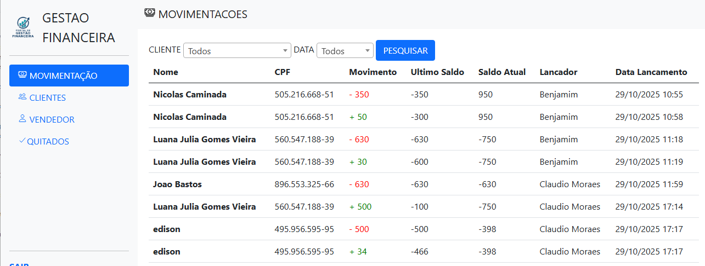

# 💰 FinansManager - Gestão de Fluxo de Caixa

O **FinansManager** é uma aplicação web desenvolvida para o controle de movimentações financeiras (entradas e saídas) de clientes. Com uma interface limpa e intuitiva, permite que o usuário tenha uma visão clara da saúde financeira em tempo real.

---

## 📸 Preview


## ✨ Funcionalidades
- [x] **Cadastro de Movimentações:** Registro detalhado de entradas e saídas.
- [x] **Gestão de Clientes:** Vinculação de transações a clientes específicos.
- [x] **Cálculo Automático:** Saldo atualizado automaticamente com base nos lançamentos.
- [x] **Histórico:** Visualização de logs de transações passadas.

## 🛠️ Tecnologias
* **Backend:** [Python](https://www.python.org/) com [Flask](https://flask.palletsprojects.com/)
* **Frontend:** HTML5 e CSS3 (Design Responsivo)
* **Banco de Dados:** SQLite (ou o que você estiver usando, ex: SQLAlchemy/PostgreSQL)

## 🚀 Como instalar e rodar

Siga estes passos para configurar o ambiente no seu computador:

### 1. Clonar o repositório
```bash
git clone [https://github.com/seu-usuario/seu-repositorio.git](https://github.com/seu-usuario/seu-repositorio.git)
cd seu-repositorio
```
### 2. Criar um Ambiente Virtual (Venv)

Isso é importante para manter as bibliotecas do projeto isoladas:

```bash
python -m venv venv
```
### 3. Ativar o Ambiente Virtual
Windows: venv\Scripts\activate

Linux/Mac: source venv/bin/activate

### 4. Instalar as dependências

```bash
pip install -r requirements.txt
```
### 5. Executar a aplicação

```bash
python app.py
```

Acesse no seu navegador: http://127.0.0.1:5000

📂 Estrutura de Pastas

Plaintext
```bash
├── static/          # Arquivos CSS e Imagens
├── templates/       # Arquivos HTML (Jinja2)
├── main.py           # Arquivo principal do Flask
├── database.db      # Banco de dados (se for SQLite)
└── requirements.txt # Lista de dependências
```
👩‍💻 Autora
Luana Julia Fullstack Developer
